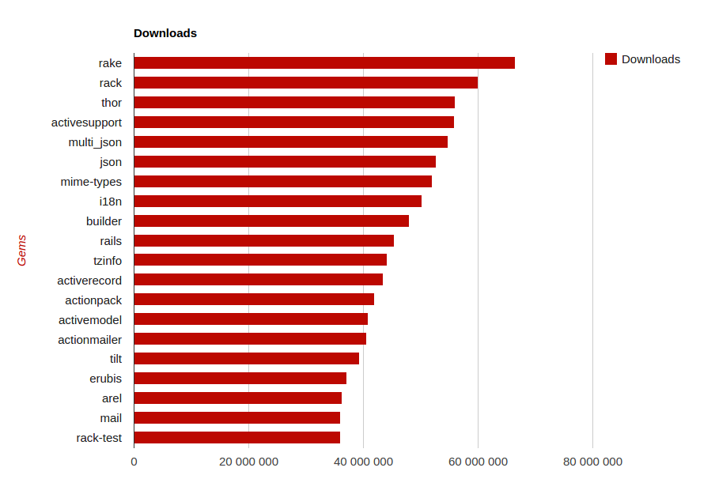

<!SLIDE subsection small transition=fade>

# The ruby GEMs

<!SLIDE center small transition=fade>

# Rubygems is...

> a package manager for the Ruby programming language that provides a standard format for distributing Ruby programs and libraries (in a self-contained format called a "gem"), a tool designed to easily manage the installation of gems, and a server for distributing them.

<a href="http://www.rubygems.org" target="_blank">www.RubyGems.org</a>

<!SLIDE commandline incremental transition=fade>

installing a GEM

    $ gem install mysql2
    Building native extensions.  This could take a while...
    Successfully installed mysql2-1.3.10
    1 gem installed

list installed GEMs

    $ gem list
    *** LOCAL GEMS ***

    addressable (2.3.6) (2.3.7)
    bigdecimal (1.2.6)
    blankslate (3.1.3)

remove old versions

    $ gem cleanup addressable
    # remove all old versions of the gem

    $ gem uninstall addressable --version 2.3.6
    # remove version 2.3.6 only

    $ gem uninstall addressable --version '<2.3.7'
    # remove all versions less than 2.3.7

<!SLIDE transition=fade>

<!SLIDE small transition=fade>

    $ gem install bundler

Create a file named *Gemfile*

    @@@ Ruby
    source 'https://rubygems.org'
    gem 'nokogiri'
    gem 'rack', '~>1.1'
    gem 'rspec', :require => 'spec'

... this downloads GEMs + creates *Gemfile.lock*

    @@@ Ruby
    GEM
      remote: https://rubygems.org/
      specs:
        actionmailer (4.2.0)
        ...

<!SLIDE center transition=fade>

# Most popular GEMs

