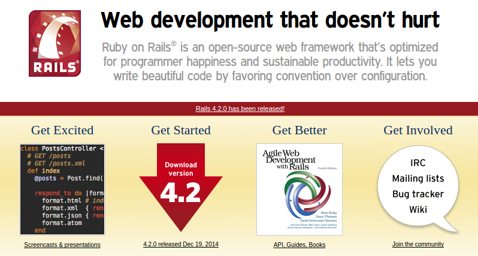
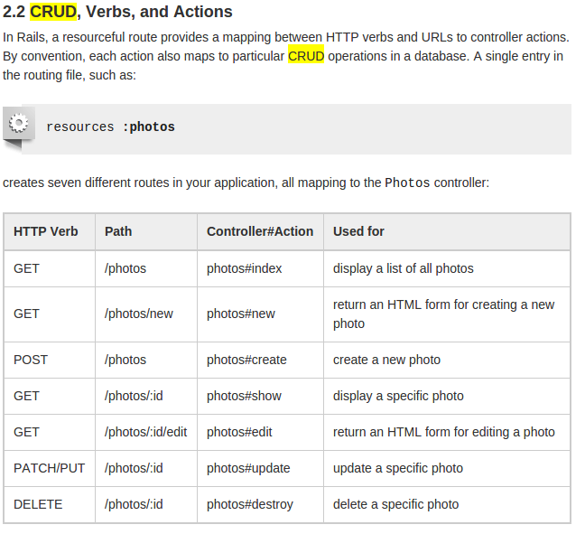

<!SLIDE subsection small transition=fade>

# Rails Savoir Vivre

<!SLIDE[bg=3rails/dhh.png] background-fit transition=fade>

<!SLIDE center transition=fade>

<!SLIDE mvc background-fit transition=fade>
mvc

<!SLIDE transition=fade>
# Components of Rails
Action Pack
Active Support
Active Record
Action Mailer
Active Resource
Active Job

<!SLIDE transition=fade>
# Action Pack
View and Controller logic

<!SLIDE transition=fade>
# Active Support
Collection of utility classes and library extensions

<!SLIDE transition=fade>
# Active Record
Object relationship mapper for various databases: MySQL (mariaDB), postgreSQL, Redis etc.

<!SLIDE transition=fade>
# Action Mailer
email delivery

<!SLIDE transition=fade>
# Ative Resource
Object relational mapper for RESTful WEB.

<!SLIDE transition=fade>
# Active Job
Wrapper for background jobs processing.

<!SLIDE center transition=fade>

<!SLIDE center transition=fade>

# Convention over configuration

RoR folder structure

.notes Show folder structure in project

<!SLIDE transition=fade>

# Naming conventions

## Model

    Table: orders
    Class: Order
    File: /app/models/order.rb
    Primary Key: id
    Foreign Key: customer_id
    Link Tables: items_orders

<!SLIDE transition=fade>

# Naming conventions

## Controller

    Class: OrdersController
    File: /app/controllers/orders_controller.rb
    Layout: /app/layouts/orders.html.erb

<!SLIDE transition=fade>

# Naming conventions

## View

    Helper: /app/helpers/orders_helper.rb
    Helper Module: OrdersHelper
    Views: /app/views/orders/… (list.html.erb for example)

<!SLIDE transition=fade>

# Behaviour Driven Development

## spec -> tests -> code

    Scenario:
    As Aveiro accounting manager
    When CEO approves invoice
    I should receive an email with document

<!SLIDE smaller transition=fade>

# Active Record Queries

    # classic
    User.all.each{|u| puts "#{u.name}: #{u.roles.map(&:role).join(",")}"}
    > User Load (0.2ms)  SELECT "users".* FROM "users"
    > Role Load (0.1ms)  SELECT "roles".*
        FROM "roles" WHERE "roles"."user_id" = ?  [["user_id", 1]]
    > Role Load (0.0ms)  SELECT "roles".*
        FROM "roles" WHERE "roles"."user_id" = ?  [["user_id", 2]]

    # smart include
    User.include(:roles).all.each{|u| puts "#{u.name}: #{u.roles.map(&:role).join(",")}"}
    > User Load (2.1ms)  SELECT "users".* FROM "users"
    > Role Load (0.1ms)  SELECT "roles".* FROM "roles" WHERE "roles"."user_id" IN (1, 2)

    # eager load
    User.eager_load(:roles).all.each{|u| puts "#{u.name}: #{u.roles.map(&:role).join(",")}"}
    > SQL (0.5ms)  SELECT "users"."id" AS t0_r0, "users"."first_name" AS t0_r1,
        "users"."last_name" AS t0_r2, "users"."email" AS t0_r3, "users"."provider" AS t0_r4,
        "users"."uid" AS t0_r5, "users"."token" AS t0_r6, "users"."image_name" AS t0_r7,
        "users"."image_uid" AS t0_r8, "users"."created_at" AS t0_r9, "users"."updated_at" AS t0_r10,
        "roles"."id" AS t1_r0, "roles"."user_id" AS t1_r1, "roles"."role" AS t1_r2, "roles"."created_at" AS t1_r3,
        "roles"."updated_at" AS t1_r4 FROM "users" LEFT OUTER JOIN "roles" ON "roles"."user_id" = "users"."id"

